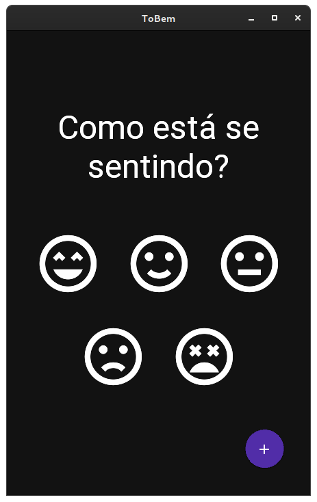

# Tobem?

Já se perguntou como você está se sentindo hoje? Como foi a sua semana? Seu mês? E se fizéssemos um diário do nosso humor para poder consultar depois e se conhecer mais?

## Como funciona?

Vamos programar uma hora do nosso dia e escolher um emoji que melhor representa como nos sentimos nesse dia.

E deixar uma mensagem para nós mesmos, para olharmos no futuro e ver como e porque nos sentimos assim em um determinado dia.

Com isso podemos olhar como está sendo determinado período da nossa vida

## Por que isso importa?

Saber como nos sentimos pode ser útil em diversos casos

- Identificar gatilhos externos e internos que causam nossas mudanças de humor
- Desenvolver algumas estratégias para tentar repetir ou evitar algumas coisas que podem nos fazer bem ou mal.
- Identificar nossos padrões durante determinados períodos.
- Descobrir o que nos deixa feliz
- Se conhcer!
